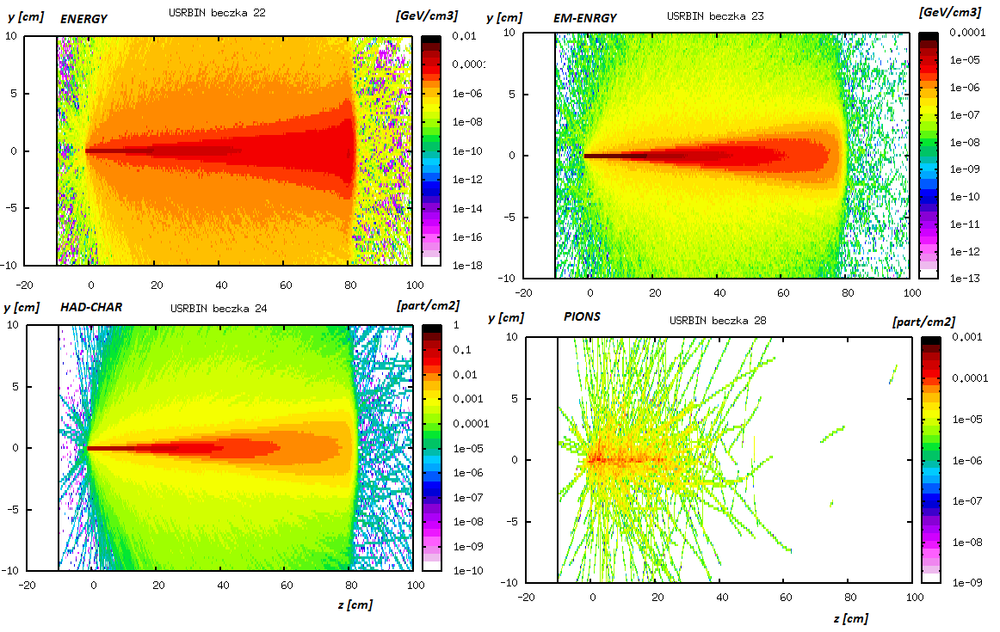
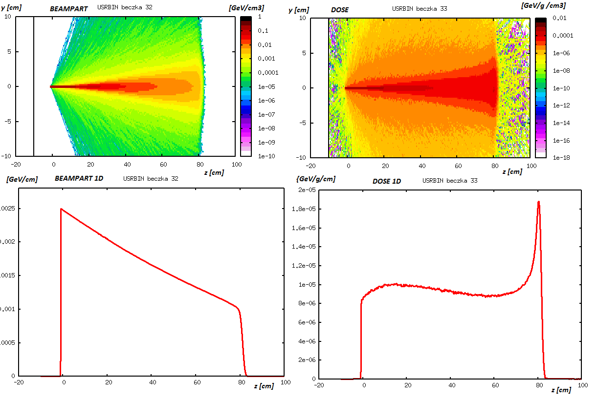

#### [HOME](https://agnieszkamucha.github.io/OPJzM/)
## Estymatory we Fluce
Rzeczywisty eksperyment przeprowadzamy w celu uzyskania konkretnych parametrów - energii zdeponowanej w pewnej objetości, policzenia produktów w zderzeniu, często w funkcji energii padającego promieniowania. Jak mamy czas i fundusze - eksperyment przeprowadzamy kilkakrotnie, a wyniki uśredniamy według zasad statystyki. 

Zamast przeprowadzenia rzeczywistego doświadczenia możemy zrobić jego symulację. O ile doświadczenie polegające na rzucie monetą jest dość łatwe do przewidzenia, to symulacje oddziaływania promieniwania z materią oparte są o metody Monte Carlo. Można bardzo ogólnie powiedzieć, że różnica jest w liczbie i stopniu pochodnych w równaniach... Ale ciągle dążymy do tego samego - na podstawie wielu eksperymentów (w MC opisanych równaniami) liczymy takie same parametry, jak w rzeczywistym eksperymencie. Jeżeli w danych rzeczywistych mówimy o wynikach - to w symulacji - o zmiennej losowej. Funkcje zmiennych losowych (najprostsza z nich to średnia) nazywamy ESTYMATORAMI. Robiąc pomiar mówimy, że np. neutron stracił energię (2.0+-0.1) MeV/mm, a robiąc symulację powiemy raczej: estymator strat energii dla neutronu wynosi (2.0+-0.1) MeV/mm. 

Obliczenia trasportu cząstek we Fluce umożliwiają wyznaczenie estymatorów szeregu parametrów, np. zdeponowanej energii, dawki, strumienia czy fluencji. Estymatory te są wbudowane i obliczane  na kilka sposobów, szczegóły można znaleźć na stronie [FLUKI](http://www.fluka.org/fluka.php?id=man_onl).

## `USRBIN`
W naszych ćwiczeniach posłużymy się jednym z estymatorów: `USRBIN`. Oblicza on estymatory depozytów energii i całowitej fluencji w trójwymiarowej siatce przestrzennej, niezależnie od geometrii regionów. Fluka używa jednostek: cm, g, GeV.  
Użycie karty estymatora `USRBIN` wymaga:
- Wyboru współrzędnych - kartezjańskich, cylindrycznych, sferycznych.
- W zależności od rodzaju współrzędnych - podania ich zakresu (tu uwaga - zakres dla depozytów energii nie może być szerszy niż wymiary geometryczne całego obiektu, fluencja może być obliczona nawet dla próżni).
- Wybrania parametru do estymacji. Jest tu cała lista, zachęcamy do testów. Najlepiej wpisać sobie kilka kart ze `USRBIN` z estymatorami różnych parametrów.
- Określenia numeru logicznego, najlepiej z rozwijanej listy, bo niektóre numery są zarezerwowane dla fortrana.
- Zdefiniowanie nazwy "detektora" - tak we Fluce nazywamy nasz estymator. Ta nazwa powinna być znacząca i może mieć do 10 znaków.
- Określenia liczby przedziałów (binów) każdej współrzędnej. Tutaj jest ograniczenie (maksymalna liczba binów to 400?), ale jeśli problem jest symetryczny w płaszczyźnie _xy_, to nie ma potrzeby dzielić np. osi _x_ (damy tam jeden przedział).  
Gestość podziału wybierzemy doświadczalnie, od tego zależy rozdzielczość naszej symulacji. Jeżeli będziemy badać zasięg promieniowania na odległości np. 1m, to rozsądnie jest podzielić ją na 500 binów.  Pamiętajmy o kropce dziesiętnej po każdej liczbie całkowitej!

Przykład definiowania `USRBIN`:

Karta `USRBIN` podaje rozkłady przestrzenne depozytów energii i całkowitej fluencji w formie kolorowych map 3D, o zawartości wybranej przez użytkownika, znormalizowanych do objętości komórki ograniczonej podanym rozmiarem binów.  
W naszych zastosowaniach wykorzystamy estymatory następujących zmiennych:
- `ENERGY` - całkowita zdeponowana energia, [GeV/cm3]
- `EM-ENERGY` - energia promieniowania elektromagnetycznego (elektrony, fotony), [GeV/cm3]
- `BEMPART` - energia zdeponowana TYLKO przez promieniowanie pierwotne (primaries), [GeV/cm3]
- `DOSE` - dawka promieniowania, [GeV/g], aby wynik był w [Gy]=[GeV/g]x1.602e-7
- `HAD_CHAR` - fluencja naładowanych hadronów, [part/cm2]
- `HADGT20M` - fluencja wysokoenergetycznych hadronów, [part/cm2]
- `PROTON`, `NEUTRON`, `PHOTON`,  `ELECTRON`, `PIONS+-`, `MUONS` - fluencja wymienionych cząstek, [part/cm2]
- `NIEL-DEP` - niejonizacyjne straty energii, [GeV/cm3]
- `SiMEVNE` - fluencja neutronów ekwiwalantnych (fluencja ważona funkcją zniszczeń),  [part/cm2]

Na wykresach, paleta barw jest proporcjonalna do wartości estymowanej (energii lub fluencji), a osie na wykresach pokazują geometryczne zakresy binowania. Wykresy dwuwymiarowe w binach zawierają uśrednioną wartość z trzeciego wymiaru. 
WAŻNE! We Fluce WSZYSTKIE wyniki liczbowe podawane są w odniesieniu do JEDNEJ cząstki padającego promieniowania (zwanej tu `Primary`). W rzeczywistym procesie znana jest liczba padających cząstek - w wiązce lub pochodzących ze źródła promieniotwórczego, wynik symulacji we Fluce należy zatem pomnożyć przez odpowiedni czynnik skalujący (można to zrobić we Flairze).

Na poniższych wykresach przedstawiono wynik kilku powyższych estymatorów (wiązka 300-MeVowych protonów uderza w zbiornik z wodą). Warto zwrócić uwagę na:
- osie i jednostki: na każdym rozkładzie te same kolory oznaczają inną wartość, na rozkładach górnych jest zdeponowana energia, na dolnych fluencja, czyli liczba cząstek na powierzchnię (gęstość śladów),
- najwięcej energii deponują hadrony, energia elektromagnetyczna jest znacznie mniejsza,
- w wyniku oddziaływania proton-woda wyprodukowały się nowe cząstki - na tym rozkładzie piony. Przy niskich energiach jest ich dość mało. Proszę porównać rozkłady fluencji pionów i mionów przy energiach rzędu GeV.

Następne wykresy zawierają przestrzenny rozkład energii zdeponowanej przez pierwotne protony i dawkę otrzymaną przez materiał zbiornika. Pod kolorowymi mapami znajdują się projekcje tych rozkładów. Zapraszam do dyskusji!

