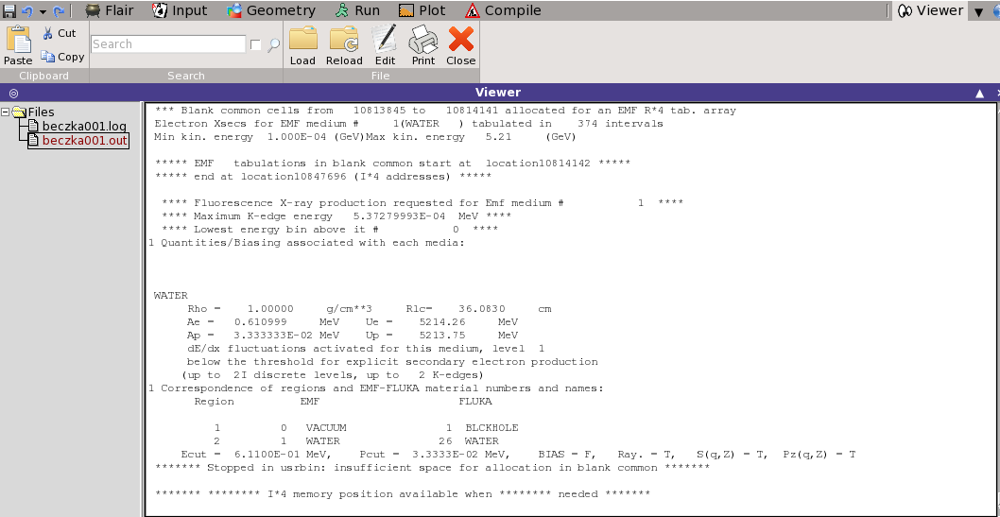

#### [HOME](https://agnieszkamucha.github.io/OPJzM/)
## Ratunku! Nie działa!
Fluka i Flair mają swoje ograniczenia. Trudno ich uniknąć, kiedy z leciwego, fortranowskiego programu robimy podstawowe narzędzie do symulacji ogromnych, skomplikowanych systemów detekcyjnych. Jeśli, pomimo uważnej edycji, wyszukania błędów opisanych w rozdziale [Start-zaczynamy pracę z FLUKĄ](Start.md), nie możesz uzyskać wyników symulacji, albo nie działa Flair, spróbuj następujących działań:
1. Flair nie działa!
- Jesteś na serwerze `lhcb1`? Może ciągle na `taurusie`? A przy otwarciu sesji zaznaczyłeś/łaś: `-X`? To pozwala na otwarcie nowych okien.
- Wykonaj skrypt startowy `$ source ~/setfluka`
2. Nie ma mojego inputu! Wczoraj tu był! 
- Poszukaj w innym katalogu, może w tzw. katalogu roboczym?
3. Symulacja nie chce odpalić! Przed chwilą działała! 
- Zamknij `Flaira`.
- Zacznij od nowego katalogu. Przekopiuj swój input do nowego, pustego katalogu i rozpocznij symulację. Flair tworzy pewną liczbę plików tymczasowych, czasem błędnie wykonana symulacja zostawia ślad i podczas procesowania danych ten błąd się wczytuje. Dotyczy to najczęściej błędów w binowaniu rozkładów.
4. Dodaję karty do `Scoringu`, a nie ma ich po symulacji! Zmieniam liczby binów, a Flair ma to w...
- Zacznij od nowego, pustego katalogu lub usuń wszystkie utworzone pliki (oprócz `.inp` oczywiście). Powód taki sam, jak powyżej.
- Rozpocznij nową sesję `Flaira`.
5. Zmianiam liczbę cykli, a Flair ciągle procesuje stare pliki!
- Rada ta sama, co w 3. Bardzo dobrym zwyczajem jest sprawdzanie po wykonaniu symulacji, czy Flair procesuje aktualne wyniki (np. patrząc na godzinę wykonania). Jeżeli był niezauważony błąd w symulacji, wykonała się raz lub nie wykonała się, a w katalogu są stare pliki, to Flair je dołączy.
6. Przy bardziej skomplikowanych problemach użyteczne jest poszukania pliku wynikowego z opisem wykonania. Flair zapisuje pliki: `input.out` i `input.err`. Poszukaj i wyedytuj je w katalogu roboczym, albo we Flairze: `Run->Flies`, potem w oknie kliknij dwukrotnie w nazwę pliku. W ten sposób można zobaczyć błąd wynikający z braku biblioteki do wykonania lub z powodu zbyt dużej liczby binów do wypełnienia, popatrz na koniec pliku: 

   
7. Dodaję nowe karty z nowymi estymatorami, a w wyniku symulacji ich ma!
- Jeśli zawiodły wymienione powyżej, proste sposoby, może to oznaczać, że dla tego właśnie estymatora potrzebne są dadatkowe karty, np. z kategorii `Physics`. W tej sytuacji odsyłamy do tutorialów: [Fluka](http://www.fluka.org/fluka.php). 
