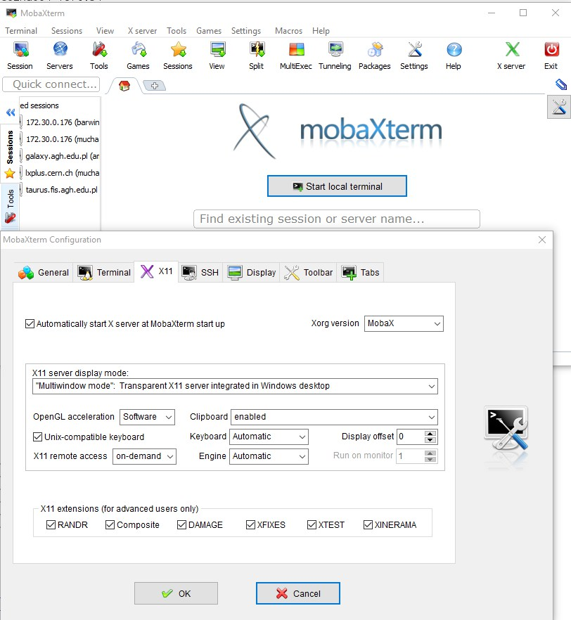



## Serwer lhcbgpu2

Instalacja FLUKI wraz z nakłądką graficzną Flair na swoim lokalnym komputerze jest skomplikowana. Jeśli jednak jesteś gotowy(a) na wyzwania, możesz spróbować procedury opisanej tutaj: [FLUKA](https://fluka.cern/), [FLAIR](https://flair.web.cern.ch/flair/tutorial_fluka.html). Trzeba zarejestrować się przynależnością do odpowiedniej instytucji. <br>

Na potrzeby studentów FLUKA została zainstalowana na naszym grupowym serwerze, fizycznie znajdującym się w budynku D11. Można dostać się na niego np. z wydziałowego `taurusa`, używając darmowej aplikacji `MobaXterm`lub z dowolnego terminala w systemie linux lub VM. 
Używając MobaXterm, proszę zwrócić uwagę, czy w ustawieniach tej aplikacji aktywna jest opcja otwierania X terminala:

[](Images/moba.jpg)

Po uruchomieniu `MobaXterm` startujemy sesję ssh: `Sessions->SSH`. W oknie `Remote host` wpisujemy: `taurus.fis.agh.edu.pl`.
Dalej już postępuje się tak samo niezależnie, czy mamy okno z linuxa, czy z Moby:  logujemy na konto swojego zespołu:
```
ssh -XY fluka-labXX@lhcbgpu2
```
Nazwy kont to: `fluka-labXX@lhcbgpu2`, gdzie XX- oznacza numer studenta. Hasła zostaną podane na zajęciach. Prosze zauważyć, że przy wpisywaniu hasła kursor jest niewidoczny. 

## Zaczynamy!
Proszę najpierw założyć wygodną dla siebie strukturę katalogów. Uruchamiamy środowisko `Flair` komendą:
```
flair &
```
i przystępujemy do wykonania pierwszego zadania: [START](Start.md).

## Uwaga!
Konto na serwerze `lhcbgpu2` jest przeznaczone tylko na cele dydaktyczne dla analiz dotyczących oddziaływania promieniowania z materią i fizyki cząstek elementarnych. Inne użycie jest niedozwolone! 
